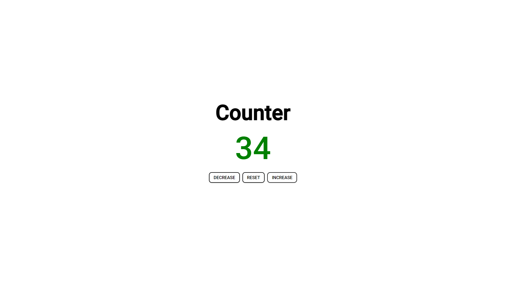

# JS_counter
**Preview** https://js-counter-by-amit.netlify.app/

This is a simple JS Counter,
the number turns green in color on getting a positive value and red on getting a negative value.

**Screenshot**

